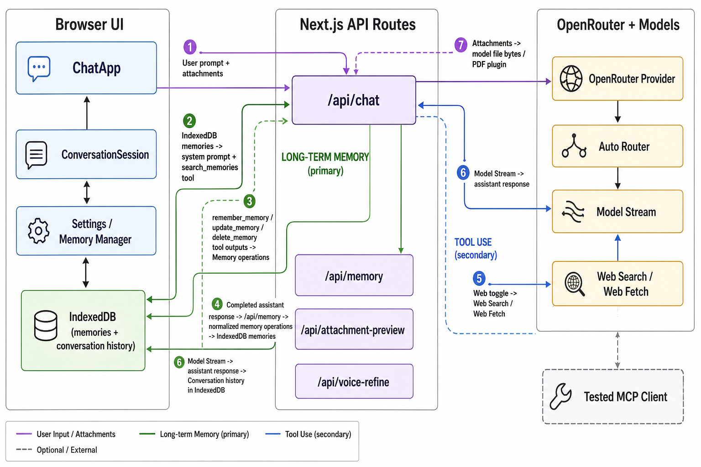

# System Introduction

`tl.chat` is a local-first personal AI chat workspace built with Next.js, React, AI SDK, and OpenRouter. The app keeps the user's working state in the browser: conversation history, settings, model preferences, and long-term memories are persisted in IndexedDB instead of a hosted database. The OpenRouter API key is also configured from the local Settings panel, so the server routes act mainly as request adapters between the browser UI and OpenRouter models.

The core chat flow starts in `ChatApp`, which loads local settings, conversations, and memories, then renders either a standard `ConversationSession` or a multi-model `CouncilSession`. In standard chat, the browser sends the latest UI message, selected model, custom model capability flags, relevant memories, attachment parts, and the Web toggle state to `/api/chat`. The API route validates the request, resolves the best model route, converts attachments into model-readable parts, registers available tools, and streams the model response back to the UI. Completed messages are saved back to IndexedDB as conversation history.

The most important system behavior is the long-term memory loop. Stored memories are injected into the system prompt through `formatMemoriesAsSystemPrompt`, while the model can also search memories through the `search_memories` tool when a direct lookup is more appropriate than reading the full memory list. When the user explicitly asks the assistant to remember, update, or forget something, `/api/chat` exposes `remember_memory`, `update_memory`, and `delete_memory` tools. These tools do not directly mutate storage; they queue validated memory operations that the client later applies through `ChatApp`, keeping memory changes reviewable and de-duplicated.

Memory can also be updated after a normal assistant response. Once streaming finishes, `ConversationSession` extracts memory operations from tool parts and hidden `<memory>` tags. If the response did not already use memory tools, it calls `/api/memory`, where a memory manager model reviews the recent conversation and returns strict JSON add/update/delete operations. Those operations are normalized against existing memories, applied to IndexedDB, and surfaced with a `Review memory` toast that opens Settings. Manual memory add/delete/clear controls remain available in the Settings memory manager.

Tool use is intentionally split into product-facing tools and implementation support. The active chat route exposes built-in AI SDK tools for current time and long-term memory operations. When the composer Web toggle is enabled, the OpenRouter provider transforms the outgoing request body to include OpenRouter-hosted `web_search` and `web_fetch` server tools. Raw tool events are hidden from the main chat surface, but their outputs remain available internally for memory extraction and model reasoning. A tested MCP client still exists in `lib/mcp.ts`, but after the current Web-first simplification it is not part of the primary user-visible tool path.

Council mode uses the same local memory foundation but runs a different orchestration loop. Selected panel models produce opening and reply messages, then a host model synthesizes the final answer. The council prompts include the memory system prompt, and hidden memory tags can still be extracted into durable memories, but the main memory/tool automation path is concentrated in standard chat through `/api/chat` and `/api/memory`.

## System Architecture Diagram

## Architecture Notes

- Browser UI owns local state: `ChatApp` coordinates conversations, settings, memories, thread actions, Settings, and the active session view.
- IndexedDB stores `conversations`, `settings`, and `memories`; there is no remote application database.
- `/api/chat` is the main runtime adapter: it validates chat requests, selects or falls back to a model, converts attachments, adds tools, and returns an AI SDK UI message stream.
- Long-term memory is used in three ways: system-prompt personalization, `search_memories` lookup, and queued mutation tools for remember/update/delete requests.
- `/api/memory` is the background memory manager: it turns recent conversation context into normalized JSON memory operations when the assistant did not already use memory tools.
- Tool use currently covers built-in memory tools, current time, and OpenRouter Web search/fetch; MCP client support remains tested but is not wired into the current primary UI.
- Attachment handling converts browser `data:` images and PDFs into model-readable bytes, while HEIC/HEIF previews use `/api/attachment-preview`.
- `/api/voice-refine` conservatively cleans Web Speech transcripts before they are inserted back into the composer.
